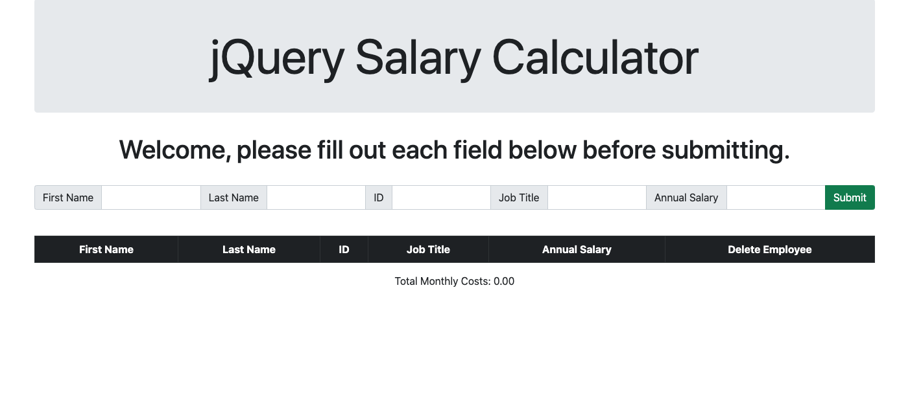

# jQuery Salary Calculator

## Screen Shot

## Usage

This is a simple application to add employees to a table.
The total monthly cost based on employees annual salaries will be shown beneath the table.

## Built With

- jQuery
- Bootstrap
- node
- SweetAlerts2

## Acknowledgement

Thanks to [Prime Digital Academy](www.primeacademy.io) who equipped and helped me to make this application a reality.

Thanks to my instructors Dane, Edan and Dev for their hard work teaching junior developers to code 

## Support
If you have suggestions or issues, please email me at [radichel.collin@gmail.com]